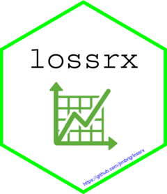

<!-- README.md is generated from README.Rmd. Please edit that file -->

# lossrx 

<!-- badges: start -->

[](https://lifecycle.r-lib.org/articles/stages.html#experimental)
[](http://www.repostatus.org/#wip)
[](https://github.com/jimbrig/lossrx/actions/workflows/pkgdown.yml)
[](https://github.com/jimbrig/lossrx/actions)
[](https://codecov.io/gh/jimbrig/lossrx?branch=main)
<!-- badges: end -->

*View the [Changelog](inst/CHANGELOG.md) for detailed progression on development of the package.*

## Contents

<!-- START doctoc generated TOC please keep comment here to allow auto update -->
<!-- DON'T EDIT THIS SECTION, INSTEAD RE-RUN doctoc TO UPDATE -->
**Table of Contents**

- [Overview](#overview)
- [Installation](#installation)
- [Data](#data)
  - [Data Preparation](#data-preparation)
  - [Database](#database)

<!-- END doctoc generated TOC please keep comment here to allow auto update -->

## Overview

The desired outcome of the `lossrx` R package is to provide actuaries and data scientists valuable tools and frameworks for performing Property Casualty related workflows.

Specifically, the package will contain:

- A suite of utility and workflow oriented functions bundled as an R package
- A plumber API that serves various endpoints related to a backend database and models
- A comprehensive, yet simple migration-friendly relational database representing the various entities, attributes, and relationships involved with actuarial reserving.[^1]
- A demo Shiny App for Actuarial Loss Development and Reserving including triangles, loss development factor selection, preliminary ultimates, etc. and a backend database/API to store results and selections.
- Comprehensive documentation and tests

## Installation

You can install the development version of `lossrx` with `pak`: [^2]

```r
pak::pak("jimbrig/lossrx")
```

## Data

### Data Preparation

This package utilizes a lot of data and in turn has a lot of code inside the [data-raw](data-raw) folder. I recommend taking a look at its [README](data-raw/README.md) to gain an understanding of how the data was prepared for both use in the package as well as included and uploaded to the database.

Data is prepared in the following ways:

- Simulated transactional claims data using the [claims_transactional.R Simulation R Script](https://github.com/jimbrig/lossrx/blob/main/data-raw/scripts/claims_transactional.R)
- Downloaded and extracted using ropensci's [piggyback package](https://github.com/ropensci/piggyback) - see the [dataprep.R Script](https://github.com/jimbrig/lossrx/blob/main/data-raw/scripts/dataprep.R).
- Supplemental *mocked data* generated using the [Mockaroo API](https://www.mockaroo.com/) for randomizing certain data attribute's.
- Uploaded and merged into the relational database using `SQL`, `R`, `CSVs`, and `YAML` files (see below about database details).
- Certain datasets are budled and included with the package as native `.rda` packaged data files.

### Database

The core database files are housed in the [inst/database](inst/database) directory and are included on package installation.

[^1]: See the [database container package](https://github.com/jimbrig/lossrx/pkgs/container/actuarialdb) for details on how to run the database as a container image.

[^2]: Similarly, you can install the package using the more common `devtools::install_github()` and `remotes::install_github()`

Latest `R CMD CHECK`:

```R
-- R CMD check results -------------------------------------- lossrx 0.0.2 ----
Duration: 1m 19.3s

0 errors v | 0 warnings v | 0 notes v

R CMD check succeeded
```

> Jimmy Briggs | 2022
