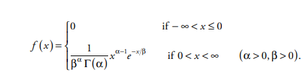
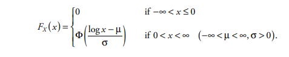

```{r, include = FALSE}
knitr::opts_chunk$set(
  collapse = TRUE,
  comment = "#>",
  results = "asis",
  message = FALSE,
  warning = FALSE
)
```

## The Importance of Statistical Distributions in Actuarial Modelling

In Property Casualty Insurance, policies are written to cover
policyholder losses that arise from unpredictable events that occur at
unforeseeable times and contain incalculable dollar values (hence the
invention of insurance!). Therefore, the field of mathematical
statistics and predictive modelling must be utilized by actuaries in
order to optimize the insurance system to ensure liquidity and
profitability.

Every Property Casualty claim process involves two independent random
variables:

-   the Claim Size Random Variable - *Severity*
-   the Claim Count Random Variable - *Frequency*

These two variables combine to create a third fundamental claim
variable: **the aggregate-loss random variable**. This represents the
total claim amount generated by the underlying claim process.

## Severity - Claim Size

The random variable associated with the size of a claim, or in other
words, its dollar amount, is based on the finite population of claims
(or a sample of it from a larger population), and always has a discrete
distribution. However, it is much more useful to assume a continuous
distribution so that various mathematical calculations and integration
can be performed on the data.

Claim sizes, by their very nature are always positive, and typically
*long-tailed* meaning larger values are more rare. This means the
distribution is not symmetric, but rather is skewed-right or *positively
skewed*.

The skewness of a continuous distribution is calculated by its
normalized third central moment, and is a useful measure of distribution
symmetry:

<center>


</center>

### The Gamma Distribution Family

Gamma distributions comprise a versatile family of probability
distributions, with many applications in statistics and probability.
Property/casualty actuaries have found them useful in constructing a
variety of insurance models -- parameter uncertainty for claim-count
distributions, approximation of aggregate-loss distributions, and
occasionally as claim-size distributions.

The gamma distribution with positive parameters $\left(a,b\right)$ is
defined by the probability density function:

<center>



</center>

where the symbol $\Gamma$ represents the **Gamma Function**:

<center>


</center>

### Lognormal Distribution

Random variable X has a lognormal distribution with parameters (µ, s) if, and 
only if, log X is normally distributed with mean µ and variance s2. Therefore, the 
lognormal variable X can be expressed as X = esZ+µ, where Z is the standard normal 
random variable. As a consequence, the lognormal cumulative distribution function is:

<center>



</center>

### Pareto Distribution

Pareto distributions bear the name of the eponymous Italian sociologist and 
economist *Vilfredo Pareto* (1843–1923), who first proposed using them in 1896.

The distribution has long been attractive to property/casualty actuaries.

The computationally simple form of the distribution function—requiring only 
algebraic calculations and no limit processes—and the typically heavy long tail have 
made the Pareto family the distributional family of choice to model claim size in a 
variety of actuarial applications.

## Frequency Distributions

-   [Poisson Distribution]()
-   [Beta-Binomial Distribution](https://reference.wolfram.com/language/ref/BetaBinomialDistribution.html)
-   [Beta-NegativeBinomial Distribution]()
-   [Geometric Distribution]()
-   [Log Series Distribution]()
-   [Negative Binomial Distribution]()

## Severity Distributions

-   [Exponential Distribution]() --- size of claims when independent and
    constant rate

-   [Pareto Distribution]() --- heavy tail claim sizes, for outsized
    claims

-   [Spliced Distribution]() --- splicing together body and tail claim
    distribution

-   [Weibull Distribution]()

-   [Half Normal Distribution]() -

Actuarial computation deals with quantifying and redistributing risk in
insurance and finance. Risks refer to financial losses and may relate to
health, cars, life, and financial investments, etc. Risks are
redistributed by grouping many individuals and analyzing the whole group
to determine premiums and risk probabilities, etc.

The Wolfram Language provides extensive support for models, data, and
computation related to finance, probability, and statistics. In life
insurance, important aspects include time value of money with either
deterministic or stochastic models of lifetimes. In non-life insurance,
important parts include the frequency and size of claims for a group,
either short term or long term

Many of the models highlighted here are related to gamma
distribution either directly or indirectly. So the catalog of
distributions starts with the gamma distribution at the top and then
branches out to the other related models.

Mathematically, the gamma distribution is a two-parameter, continuous
distribution defined using the gamma function.

The gamma sub-family includes the exponential distribution, Erlang
distribution, and chi-squared distribution.

These are distributions that are gamma distributions with certain
restrictions on one or both of the gamma parameters.

Other distributions are obtained by raising a distribution to a power;
Others are obtained by mixing distributions.

Here's a listing of the models:

|           Deivation           |           Distribution            |
|:-----------------------------:|:---------------------------------:|
|        Gamma Function         |        Gamma Distribution         |
|      Gamma Sub-Families       | Erlang, Exponential, Chi-Squared  |
|   Independent Sum of Gammas   |     Erlang, Hypo-Exponential      |
|        Exponentiation         |             Lognormal             |
|  Raised to a Positive Power   |              Weibull              |
| Raised to a Exponential Power | Transformed Exponential = Weibull |


## Fitting Distributions

Actuaries frequently need to fit a *parametric* distribution model to a
set of claims data in order to a) smooth the empirical distribution and
b) interpolate or extrapolate between or beyond the existing data.

`lossrx` provides some useful helper functions meant to aid an actuary in 
determining an optimal parametric distribution to fit the data at hand:

```{r, eval=FALSE}
library(lossrx)

data("claims_transactional")
data("losses")
data("exposures")

latest_eval <- losses |> dplyr::filter(eval_date == max(.data$eval_date))
wc_dat <- latest_eval |> dplyr::filter(coverage == "WC", total_incurred > 0)
al_dat <- latest_eval |> dplyr::filter(coverage == "AL")

describe_distribution <- function(data, ...) {

  fitdistrplus::descdist(data = data, boot = 1000, ...)
  
}

describe_distribution(wc_dat$total_incurred)
```
