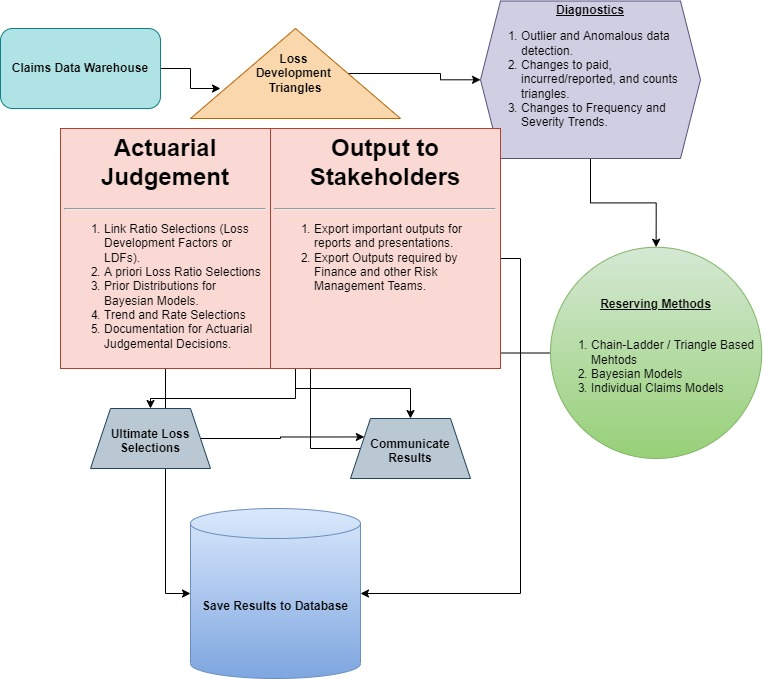

```{r setup, include = FALSE}
knitr::opts_chunk$set(
  collapse = TRUE,
  comment = "#>",
  echo = FALSE,
  eval = TRUE,
  messages = FALSE,
  warnings = FALSE,
  error = FALSE,
  output = "asis"
)

library(knitr)
library(kableExtra)
library(tibble)
library(dplyr)
library(tidyr)
library(purrr)
library(lubridate)
library(timevis)
```

## Getting Started with `lossrx`

```{r}
# library(lossrx)
devtools::load_all()
```

## Overview {#Overview}

This vignette introduces readers to methods used by actuaries to analyze
and model *insurance claims data*, specifically, how to apply **Loss
Reserving** techniques.

**NOTE:**

-   This vignette is specific to Loss Reserving (also known as claims
    reserving) for **Property and Casualty** (P&C, or general, non-life)
    insurance products.
-   In particular, this vignette walks through some of the basic, yet
    essential, analytic tools actuaries use to assess the reserves on a
    portfolio of P&C insurance products.

## Life Cycle of a Claim

Our starting point is the Lifetime of a P&C Insurance Claim.

The figure below pictures the development of such a claim over time and
identifies the events of interest:

{width="60%"}

The insured event or accident occurs at time $t_{occ}$. This incident is
reported to the insurance company at time $t_{rep}$, after some delay.
If the filed claim is accepted by the insurance company, payments will
follow to reimburse the financial loss of the policyholder. In this
example the insurance company compensates the incurred loss with loss
payments at times $t_1$, $t_2$ and $t_3$. Eventually, the claim settles
or closes at time $t_{set}$.

### Various Events throughout Life of a Claim

The different types of claim transactions over the life of an individual
insurance claim could include:

-   Establishment of the initial case outstanding estimate
-   Notification to the reinsurer if the claim is expected to exceed the
    insurer's retention
-   A partial claim payment to injured party
-   Expense payment for independent adjuster
-   Change in case outstanding estimate
-   Claim payment (assumed to be final payment)
-   Takedown of case outstanding and closure of claim
-   Reopening of the claim and establishment of a new case outstanding
    estimate
-   Partial payment for defense litigation
-   Final claim payment
-   Final payment for defense litigation
-   Closure of claim

These events can be summarized in a unified **Claim Fact Summary
Document**:

```{r claim_fact_summary_tbl_1}
tibble::tribble(
  ~ "", ~"  ",
  "Policy Period", "January 1, 2020 to December 31, 2020",
  "Date of Accident", "February 18, 2020",
  "Date of Claim Report", "March 3, 2020",
) |>
  knitr::kable(caption = "Table 1: Claim Fact Summary") |>
  kableExtra::kable_styling()
```

```{r claim_fact_summary_tbl_2}
tibble::tribble(
  ~ "Date", ~"Transaction", ~"Reported Value of Claim to Date", ~"Cumulative Paid to Date",
  "March 3, 2020", "Case Outstanding Reserve of $15,000 Established for claim.", formattable::currency(15000), formattable::currency(0),
  "April 1, 2020", "Claim Payment of $1,500 - Case reduced to $13,500 (-$1,500)", formattable::currency(15000), formattable::currency(1500),
  "May 12, 2020", "Expense Payment to IA of $500 - no change in case.", formattable::currency(15500), formattable::currency(2000),
  "September 1, 2020", "Case increased to $30,000 (+$16,500)", formattable::currency(32000), formattable::currency(2000),
  "October 3, 2020", "Claim thought to be settled with additional payment of $24,000 - case reduced to $0 (-$30,000) and claim marked as Closed.", formattable::currency(26000), formattable::currency(26000),
  "January 15, 2021", "Claim Re-Opened with case outstanding set at $10,000 for claim and $10,000 for defense costs.", formattable::currency(46000), formattable::currency(26000),
  "February 19, 2021", "Final defense cost payment for an additional $6,000 - case for defense costs zeroed out and claim set to Closed.", formattable::currency(52000), formattable::currency(52000)
) |>
  knitr::kable() |>
  kableExtra::kable_styling()
```

As you can see there is quite a lot of detail that a single insurance
claim can contain over the course of its lifetime.

It is important to note all the various important *Dates* associated with each claim:

- Policy effective date is the date the insurer issues the insurance policy (January 1, 2020) 
- Accident date, or date of loss, is the date the covered injury occurs (February 18, 2020) 
- Report date is the date the insurer receives notice of the claim (March 3, 2020) 
- Transaction date is the date on which either a case outstanding transaction takes place or a payment is made (see all the dates in the preceding table) 
- Closing dates are the dates on which the claim is initially closed (October 3, 2020) and finally closed (February 19, 2021) 
- Reopening date is the date the insurer reopens the claim (January 15, 2021) 

## Viewing Claim Historical Transactions with `lossrx`

`lossrx` provides some convenient helper functions for viewing the timeline and informative details over 
the course of an individual claim's lifetime by pulling the specified claim's transaction data directly from 
the Actuarial Database:

```{r example_claim_lifetime, echo=TRUE}
claims <- claims_transactional

# get a random claim
claim <- claims[round(runif(1, 1, nrow(claims)),0), "claim_id"][[1]]

# gather claim history
claim_history <- view_claim_history(claim, claims_data = claims)
```

### Claim Historical Timeline

*Note: Click on a Date to view information about the transaction that occurred.*

```{r claim_timeline, out.width='100%', out.height='300px'}
# view claim's timeline
claim_history$Timeline
```

### Claim History Details

```{r claim_history_details}
# view claim's details
knitr::kable(claim_history$Details, caption = "Claim Details") |> kableExtra::kable_styling()
```

### Claim Transactional History

```{r claim_transactions}
# view claim's transactions
claim_history$Transactions |>
  dplyr::mutate_if(is.numeric, ~ as.character(formattable::currency(.x, digits = 0))) |>
  knitr::kable(caption = "Claim Transactional History") |>
  kableExtra::kable_styling(font_size = 8)
```

## Workflow

<center>



</center>
